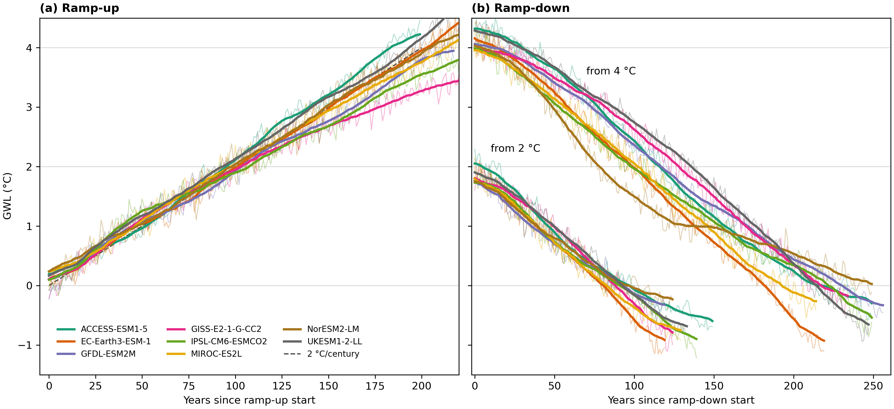

# tipmip-gwl

Re-index TIPMIP ramp-up and ramp-down output from **calendar time** onto a **global warming level (GWL)** axis so models can be compared at the same warming rather than the same year.

Install the package, load a bundled mapping, and apply it to your own annual diagnostic:

```bash
pip install -e .
```

```python
from tipmip_gwl import load_mapping, list_models, resample_to_gwl, relabel_to_gwl

print(list_models())
# ['ACCESS-ESM1-5', 'EC-Earth3-ESM-1', 'GFDL-ESM2M', ...]

mp = load_mapping("GFDL-ESM2M")
on_gwl = resample_to_gwl(mp, my_annual_diagnostic)   # shared 0.02 °C grid
# on_native = relabel_to_gwl(mp, my_annual_diagnostic)  # model's own GWL axis
```

Full API guide: [docs/using_mappings.md](docs/using_mappings.md).

## Two transforms

| Function | Output axis | Use when |
|----------|-------------|----------|
| `resample_to_gwl` | shared GWL grid (0–4 °C ramp-up; −2–5 °C ramp-down; 0.02 °C steps) | stacking or comparing models at the same GWL |
| `relabel_to_gwl` | native per-model GWL (uneven, unbinned) | plotting one model without binning |

Both operate on **annual** data whose coordinate values are calendar years. Values are never extrapolated beyond each model's realised warming range.

## Bundled mappings

The published Tier-1 ensemble (mapping version `v1`) ships inside the package:

- **8 ramp-up** mappings (`esm-up2p0`) — default via `load_mapping(model)`
- **16 ramp-down** mappings (8 from the 2 °C hold, 8 from the 4 °C hold) — via `load_mapping(model, leg="ramp-down-2c")` or `leg="ramp-down-4c"`

You do not need to download separate NetCDF files for these legs. Zero-emission-hold mappings are not bundled.

Each mapping file is a **coordinate product** (`year_of_gwl`, `gwl_axis`, baseline and provenance metadata), not remapped fields. Apply it to your own variable with the functions above.

To use a locally rebuilt mapping instead, pass `mapping_dir=` or `path=` to `load_mapping`.

### Ensemble overview

Ramp-up and both ramp-down legs for each model share one piControl baseline. Thin lines in the figure below are annual GMSAT anomalies; thick lines are the monotone axis used for re-indexing (31-year centred running mean + isotonic regression).



| Model | Legs bundled | Baseline caveat |
|-------|--------------|-----------------|
| IPSL-CM6-ESMCO2 | ramp-up, dn-2 °C, dn-4 °C | — centred 31-yr window at branch year (1849) |
| GISS-E2-1-G-CC2 | ramp-up, dn-2 °C, dn-4 °C | — centred window (2156) |
| UKESM1-2-LL | ramp-up, dn-2 °C, dn-4 °C | Branch year **2277** patched in code (`KNOWN_BRANCH_YEARS`; wrong or missing in staged attrs) |
| GFDL-ESM2M | ramp-up, dn-2 °C, dn-4 °C | — centred window (1961) |
| NorESM2-LM | ramp-up, dn-2 °C, dn-4 °C | **Full piControl mean** — branch year (1600) outside staged record (1851–2100) |
| ACCESS-ESM1-5 | ramp-up, dn-2 °C, dn-4 °C | **Trailing 31-yr window** — branch at first piControl year (271); centred window not possible |
| EC-Earth3-ESM-1 | ramp-up, dn-2 °C, dn-4 °C | **Trailing 31-yr window** — branch at piControl start (1850) |
| MIROC-ES2L | ramp-up, dn-2 °C, dn-4 °C | — centred window (2001) |

Per-model drift, reference temperatures, and monotonicity diagnostics: `paper/tables/table1.csv`, `paper/tables/table_mono_max.csv` (also Tables A1–A2 in the GMD paper).

## Repository layout

```
src/tipmip_gwl/          user library (load_mapping, resample/relabel; bundled data)
scripts/                 maintainer staging (gmstmon build, diagnostics, sync)
docs/                    user and maintainer guides
examples/                tutorial notebook
paper/                   reproduce figures/tables (pip install -e ".[paper]")
exploratory/             deferred work (e.g. ZE-hold; not installed)
mapping/                 local rebuild output (optional)
```

## Documentation

| Guide | Audience |
|-------|----------|
| [docs/README.md](docs/README.md) | **Doc index** — user vs maintainer guides |
| [docs/using_mappings.md](docs/using_mappings.md) | **Users** — resample, relabel, ensemble stacks |
| [docs/building_mappings.md](docs/building_mappings.md) | **Maintainers** — build mappings, sync bundled data |
| [docs/gmstmon_pipeline.md](docs/gmstmon_pipeline.md) | **Maintainers** — tas → gmstmon |
| [docs/paper_figures.md](docs/paper_figures.md) | **Paper reproduction** — `paper/build_all.py` |
| [AGENTS.md](AGENTS.md) | **Coding agents** — architecture, gotchas, commands |

## Reproducing paper figures

Paper figures and tables are built from staged TIPMIP data, not from the library alone. See [docs/paper_figures.md](docs/paper_figures.md).

## Tutorial

Open [examples/resample_diagnostic.ipynb](examples/resample_diagnostic.ipynb) for a
worked example of `load_mapping` → `resample_to_gwl` on a synthetic diagnostic.

## Citation

If you use these mappings or the resampling method in published work, cite the accompanying GMD paper (in preparation) and pin the package version (`tipmip_gwl.__version__`) and mapping version (`v1`).

## License

BSD-2-Clause — see [LICENSE](LICENSE).
