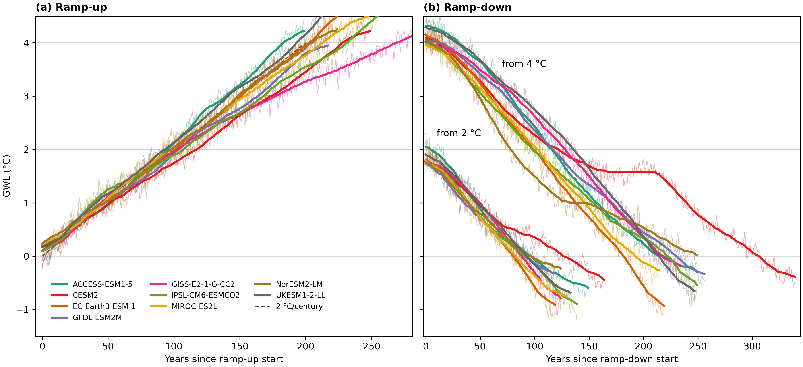

# tipmip-gwl

Re-index TIPMIP ramp-up and ramp-down output from **calendar time** onto a **global warming level (GWL)** axis so models can be compared at the same warming rather than the same year.

## Install

```bash
git clone https://github.com/tipmip-methods/tipmip-gwl.git
cd tipmip-gwl
pip install -e .
```

**Mapping products** (`gwlmap_*_v1.nc`) are bundled in [`mapping/`](mapping/) (27 NetCDF
coordinate files, version `v1`). Override the search path:
`export TIPMIP_GWL_MAPPINGS=/path/to/mappings`.

## Quick use

```python
import xarray as xr
from tipmip_gwl import load_mapping, resample_to_gwl

# Mapping product: xarray Dataset (year_of_gwl, gwl_axis, baseline metadata)
mp = load_mapping("GFDL-ESM2M")

# Your annual variable: xarray DataArray (or Dataset) with a "year"
# dimension — global mean, regional index, or full grid (lat/lon, etc.)
diagnostic = xr.open_dataset("mlotst_GFDL-ESM2M_esm-up2p0.nc")["mlotst"]  # (year, …)

# Same values; "year" replaced by shared GWL coordinate (0.02 °C steps)
on_gwl = resample_to_gwl(mp, diagnostic)  # (gwl, …)
```

Worked example: [examples/resample_diagnostic.ipynb](examples/resample_diagnostic.ipynb).

## Three purposes

| Purpose | Where to start |
|---------|----------------|
| **1. Use mappings** | [docs/using_mappings.md](docs/using_mappings.md) — `load_mapping`, `resample_to_gwl` |
| **2. Build mappings** | [docs/building_mappings.md](docs/building_mappings.md) — gmstmon → `gwlmap_*.nc` |
| **3. Reproduce paper** | [docs/paper_reproduction.md](docs/paper_reproduction.md) — figures, tables, staged data |

**Users:** [docs/using_mappings.md](docs/using_mappings.md) — API reference.  
**Maintainers:** [docs/building_mappings.md](docs/building_mappings.md), [docs/staged_data.md](docs/staged_data.md).

## Mapping products (v1)

Bundled under `mapping/`:

- **9 ramp-up** (`load_mapping(model)`)
- **18 ramp-down** (`leg="ramp-down-2c"` or `"ramp-down-4c"`)

Each file is a **coordinate product** (`year_of_gwl`, `gwl_axis`, baseline metadata), not remapped fields. The anomaly zero is the piControl reference GMSAT recorded as `baseline_gmsat` (method in `baseline_method`).

### Included models (v1)

| Model | Included | Baseline (piControl reference) |
|-------|:--------:|--------------------------------|
| ACCESS-ESM1-5 | ✅ | 31-yr trailing mean at branch |
| CESM2 | ✅ | 31-yr centred mean at branch (81; patch CMIP attrs) |
| EC-Earth3-ESM-1 | ✅ | 31-yr trailing mean at branch |
| GFDL-ESM2M | ✅ | 31-yr centred mean at branch |
| GISS-E2-1-G-CC2 | ✅ | 31-yr centred mean at branch |
| IPSL-CM6-ESMCO2 | ✅ | 31-yr centred mean at branch |
| MIROC-ES2L | ✅ | 31-yr centred mean at branch |
| NorESM2-LM | ✅ | 31-yr trailing mean at branch (1851; patch CMIP attrs) |
| UKESM1-2-LL | ✅ | 31-yr centred mean at branch |

**Baseline rules:** when CMIP branch metadata decodes to a year inside the staged piControl record, the reference is the **31-yr mean centred on that branch year**; if the centred window would start before piControl begins (branch at control start), the first **31-yr trailing** segment is used instead. Otherwise the **full piControl mean** is used. Full diagnostics: `paper/tables/table_baseline_diagnostics.csv` (Appendix A1).



## Install extras

Paper reproduction and tests: `pip install -e ".[paper,test]"` — see
[docs/paper_reproduction.md](docs/paper_reproduction.md) for figure/table commands and
staged-data layout.

## Citation

Cite the accompanying GMD paper (in preparation) and pin `tipmip_gwl.__version__` and mapping version `v1`.

## License

BSD-2-Clause — see [LICENSE](LICENSE).
